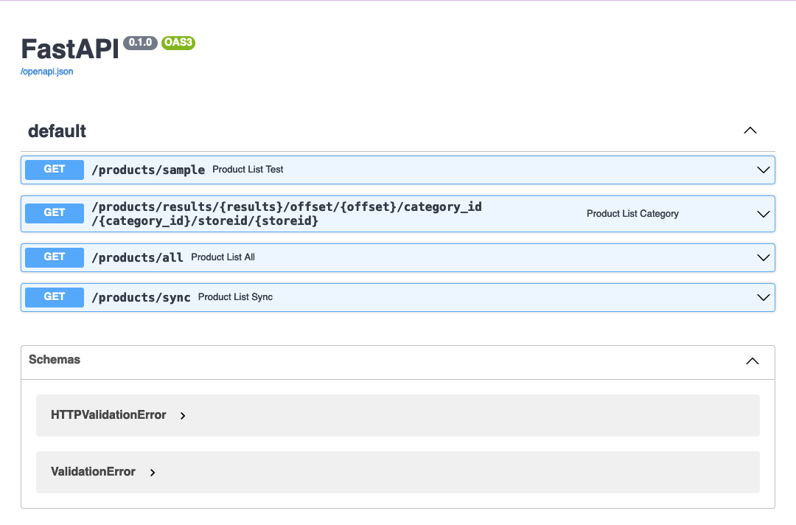

# :convenience_store: **(DEPRECATED)** safeway-scrubber

**(DEPRECATED)** Have refactored and moved this code to the [munch-bot](https://github.com/mhakimi-adi/munch-bot) repo.

This api is a POC to grab safeway data from their api and store it in `mysql`.

## :hammer: Build

Prequisites: 
- `python` installed
- `conda` installed

```bash
conda create --name my_project_env
conda activate my_project_env
pip install -r requirements.txt
uvicorn main:app --reload --host 0.0.0.0
```

## :point_left: Endpoints

There are **four** different endpoints in this api:

`/products/sample` - returns a random set of products from the safeway industry.

`/products/results/{results}/offset/{offset}/category_id/{category_id}/storeid/{storeid}` - returns a list of products filtered by a specific category and store location.

`/products/all` - saves the entire store's product inventory to a `data.json` file.

`/products/sync` - uploads the data from `data.json` to a mysql db.

## :clipboard: Swagger

To access the swagger documentation simply go to `http://localhost:8000/docs`:


